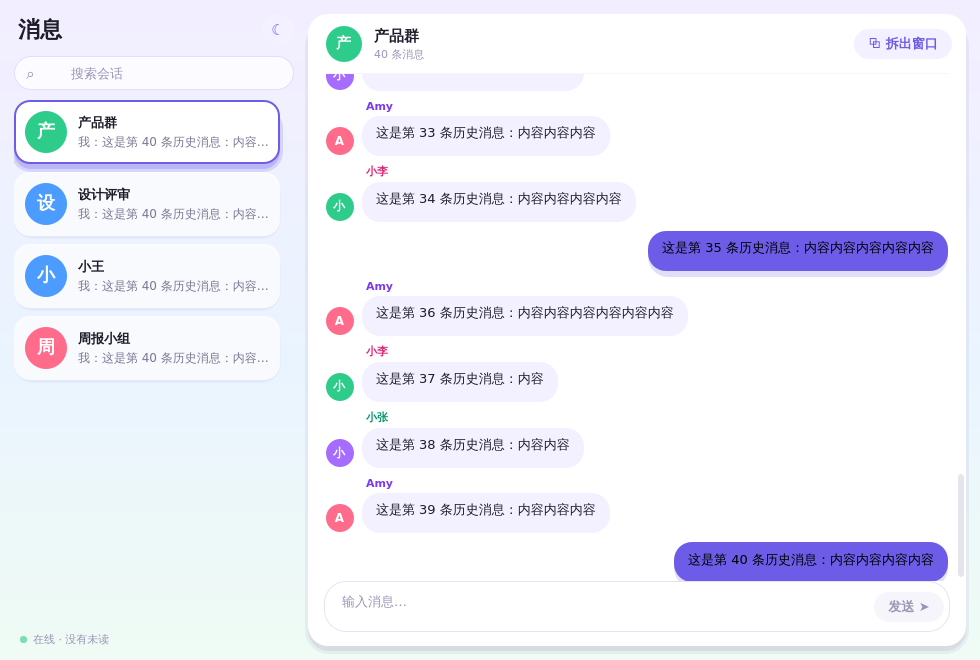
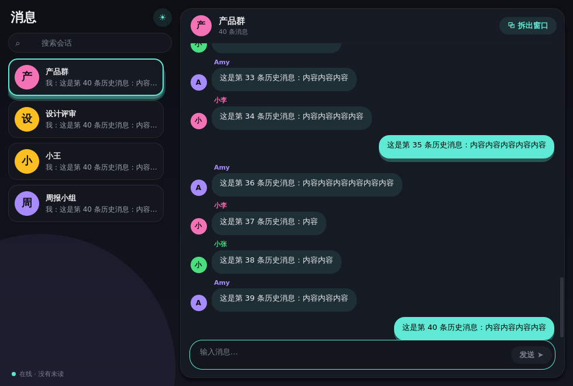
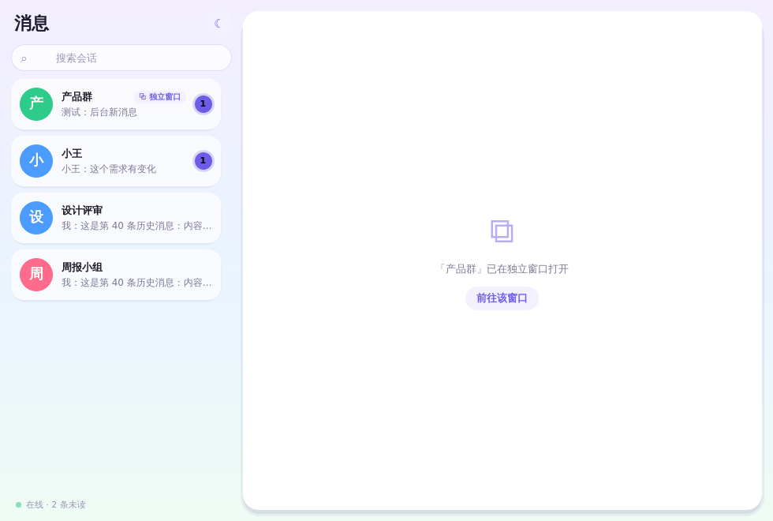
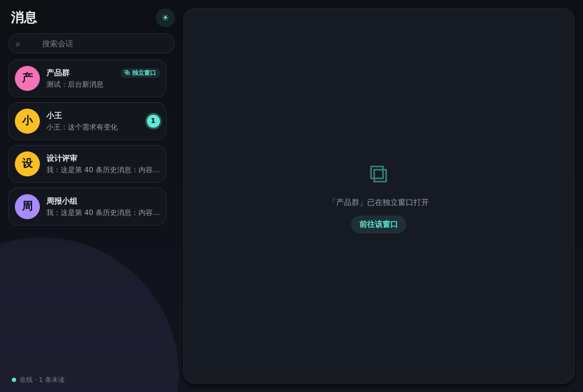

# chat-demo-qt（路线 B：Qt 6 + QML + C++）

桌面 IM 多窗口 Demo 的 Qt 版，方案见 [`../ChatDemo/PLAN.md`](../ChatDemo/PLAN.md) 第 3～6、8 节。覆盖 M1～M4。
单进程、单个 `QQmlEngine`，所有窗口共享同一组 C++ 单例（对应微信 4.0 的「核心只有一份」）。

## 构建与运行

需要 Qt 6.4+（Core / Gui / Qml / Quick / QuickControls2 / Widgets）和 CMake 3.21+。

```bash
cd chat-demo-qt
cmake -B build -DCMAKE_PREFIX_PATH=/path/to/Qt/6.x/macos   # 系统包安装的 Qt 可省略
cmake --build build -j
./build/bin/ChatDemo
```

| 快捷键（Qt 在 macOS 上自动把 Ctrl 映射为 ⌘） | 作用域 | 行为 |
|---|---|---|
| `Ctrl+Shift+O` | 主窗口 | 把当前会话拆到新窗口 |
| `Ctrl+Shift+M` | 独立窗口 | 合并回主窗口 |
| `Ctrl+Shift+D` | 任意窗口 | 切换浅色 / 深色主题（所有窗口同步，持久化） |
| `Ctrl+W` | 当前窗口 | 主窗口关闭右侧会话；独立窗口关闭该窗口 |
| `↩` / `⇧↩` | 输入框 | 发送 / 换行 |

拆出入口：右键「在新窗口打开」、双击会话、快捷键、拖出主窗口（新窗口落在光标处）。
关闭主窗口 = 退出 Demo（避免只剩独立窗口时布局被清掉）。

## 结构

| 文件 | 职责 |
|---|---|
| `src/chatstore.*` `src/models.*` | 会话列表模型 + 每个会话的消息模型 + 未读；收到消息时决定「计未读 / 发通知」 |
| `src/uistatestore.*` | 草稿、光标、滚动锚点、引用、未读分隔线；**写入租约**（token 不匹配直接丢弃）；草稿 JSON 持久化 |
| `src/windowmanager.*` | Placement、拆出/合并流程、单实例、输入法组合延迟、布局持久化（QSettings）、通知路由 |
| `src/mockserver.*` `src/notifier.*` | 每 3～8 秒随机推消息；`QSystemTrayIcon::showMessage`（无托盘时降级为日志） |
| `qml/ChatView.qml` | 主窗口与独立窗口共用的会话视图：挂载时恢复、变化时经租约写回 |
| `qml/Main.qml` `ConversationList.qml` `DetachedWindow.qml` | 容器与列表（拖出检测、右键菜单、快捷键） |
| `qml/Theme.qml` | 双色板单例：Light（柔和渐变底 + 紫色强调）/ Dark（深空底 + 青绿霓虹）；`WindowManager.darkMode` 持久化 |
| `qml/Card.qml` `Avatar.qml` `MacButton.qml` | 悬浮卡片（伪投影，不依赖 GraphicalEffects）、首字头像、胶囊按钮 |

## 与 SwiftUI 版的差异

- **光标位置能保存**：`TextArea.cursorPosition / selectionStart / selectionEnd` 可用，验收用例 1 完整满足（SwiftUI 版做不到）。
- **单实例要自己实现**：`WindowManager` 里 `m_windows` 已有则 `raise()` + `requestActivate()`，否则创建；SwiftUI 由系统提供。
- **迁移前 flush**：`UIStateStore::flush()` 发信号，视图的 `Connections` 立即写回，再改 Placement。
- **通知点击**：`QSystemTrayIcon` 不告诉点的是哪条通知，Demo 取最近一条；正式方案需换平台原生通知 API。
- **退出**：`QEvent::Quit` 事件过滤器 + `quitApp()` 先标记「退出中」，否则窗口 closing 会把独立窗口的 Placement 清掉。

## 无头自测

`--selftest` 用真实的 QML 视图 + WindowManager 在 offscreen 平台跑一遍核心用例（共 28 项断言）：

```bash
export QT_QPA_PLATFORM=offscreen CHATDEMO_DATA_DIR=$(mktemp -d)
./build/bin/ChatDemo --selftest            # phase 1：草稿/光标迁移、输入法延迟、单实例、租约、未读+通知、合并、关闭
./build/bin/ChatDemo --selftest --phase2   # phase 2：重启后恢复独立窗口与草稿
```

已自动覆盖的验收用例：1、3、4、5、窗口恢复后自动滚到「新消息」分隔线（用 `setComposing` 模拟组合态）、6/9（最小化窗口的未读与通知）、10、12。
**需要真机手动验证**：用例 2（滚动锚点，离屏没有真实滚动）、7（点击通知前置窗口）、8（key 窗口可见时不通知，需要真实焦点）、11（外接屏）、真实输入法组合。
截图：`CHATDEMO_SHOT=/tmp/a.png` 配合 `--selftest` 会保存主窗口截图。

## 截图（offscreen 自测中抓取，`--selftest` + `CHATDEMO_SHOT=路径前缀`）

| | Light | Dark |
|---|---|---|
| 主窗口 |  |  |
| 拆出后的主窗口 |  |  |
| 独立窗口（草稿 + 引用 + 新消息） |  |  |

动效：选中会话卡片轻微漂浮、hover 上浮；未读角标数字增加时弹跳；新消息从底部上浮进入；发送按钮按下回弹；主题切换时各颜色 260ms 渐变、切换按钮旋转一圈。
`CHATDEMO_DARK=1` 可强制以深色启动（自测/截图用）。
